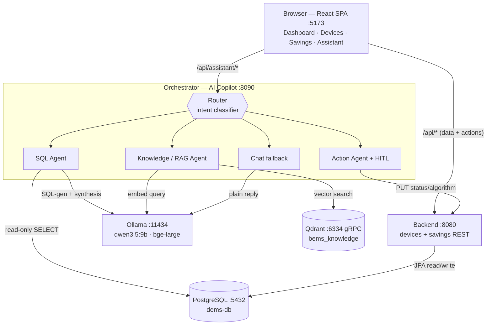
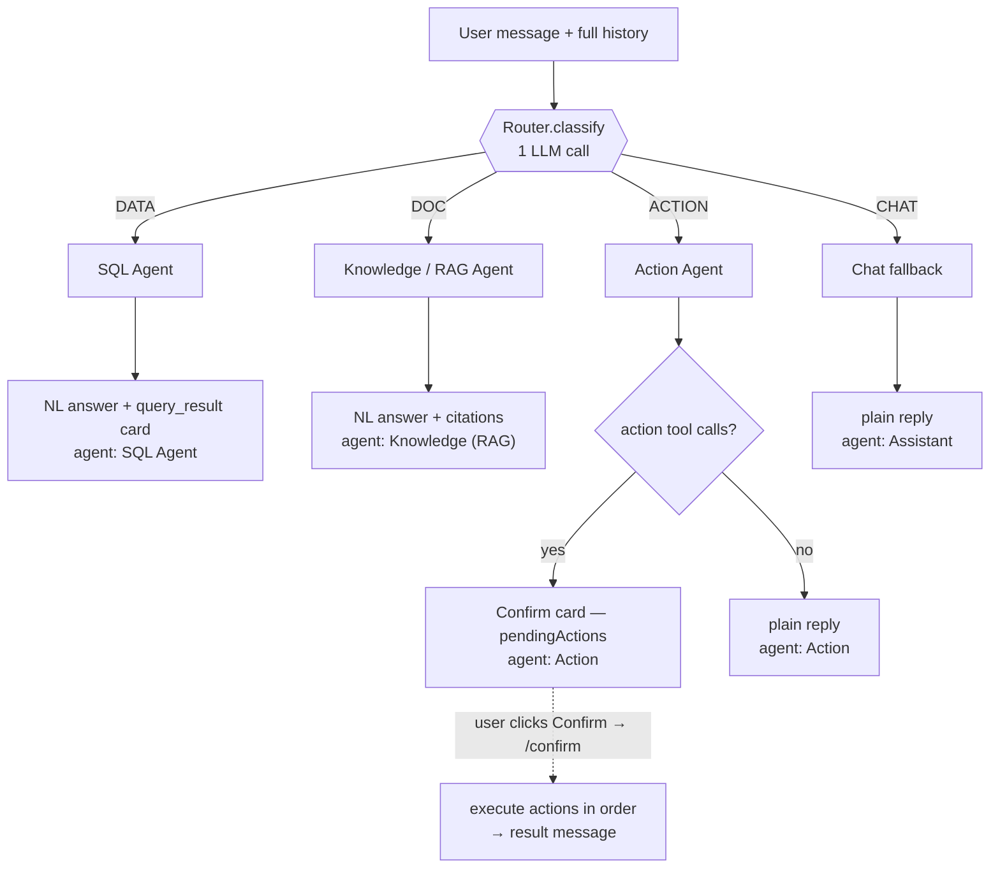
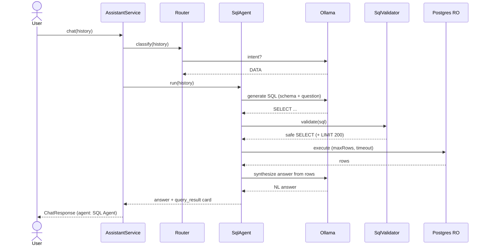
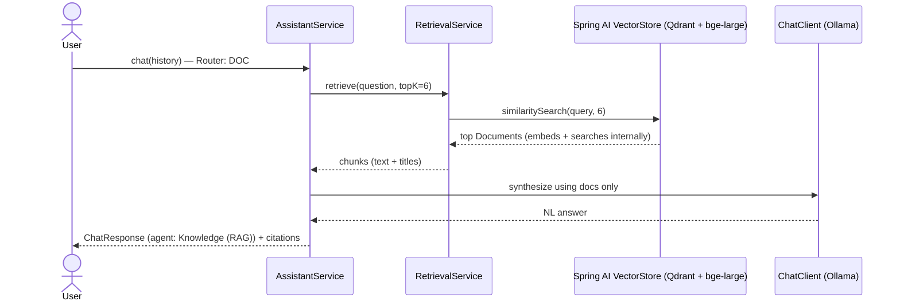
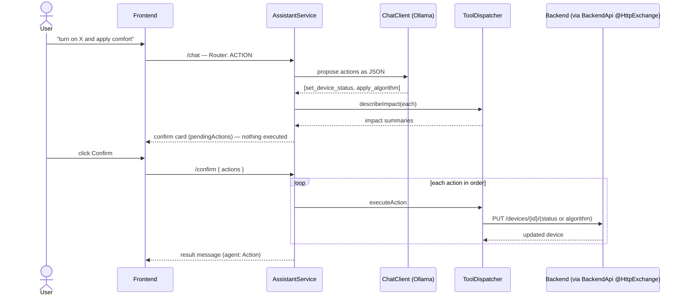

# DEMS — Design Document

**DEMS** (Device Energy Management System) is an air‑gapped building energy platform with
an on‑device **AI Copilot**. Operators manage AC devices and energy‑saving algorithms, view
usage/savings analytics, and interact through a natural‑language assistant — all running
locally with **zero internet dependency**.

This document focuses on the **AI Copilot / Orchestrator**. Frontend and backend are summarized;
the orchestrator is covered in depth (agents, flows, safety, setup).

---

## 1. System at a glance



**Everything is local / air‑gapped.** No service makes outbound internet calls.

| Component     | Tech                                   | Port  | Role |
|---------------|----------------------------------------|-------|------|
| Frontend      | React 19 + TypeScript + Vite           | 5173  | UI + conversational assistant |
| Backend       | Spring Boot 4.1 (Java 21) + JPA        | 8080  | Devices/savings system of record |
| Orchestrator  | Spring Boot 4.1 + **Spring AI 2.0** (Java 21) | 8090  | AI Copilot: router + agents |
| LLM runtime   | Ollama — `qwen3.5:9b` (Q4_K_M)         | 11434 | Chat, routing, SQL‑gen, synthesis |
| Embeddings    | Ollama — `bge-large` (1024‑dim)        | 11434 | RAG embeddings |
| Vector DB     | Qdrant                                 | 6333 (REST) · 6334 (gRPC) | Knowledge retrieval |
| Database      | PostgreSQL 18 — `dems-db`              | 5432  | Persistent storage |

---

## 2. Data model (reference)

`devices`
| column | type | notes |
|---|---|---|
| id | varchar PK | e.g. `ac-001` |
| name, location, model | varchar | |
| status | varchar | enum, UPPERCASE: `ONLINE` / `OFFLINE` |
| current_tempc, setpointc | double | °C |
| powerw | int | current draw (0 when offline) |
| nominal_powerw | int | rated draw (restored on turn‑on) |
| algorithm | varchar | enum, UPPERCASE: `COMFORT` / `TARGET` / `NONE` |

`saving_records` — one row per device per period
| column | type | notes |
|---|---|---|
| id | bigint PK | |
| device_id | varchar FK → devices.id | |
| granularity | varchar | `DAILY` / `MONTHLY` |
| period | varchar | `YYYY-MM-DD` (daily) / `YYYY-MM` (monthly) |
| usage_kwh, usage_cost | double | energy consumed + its cost |
| energy_saved_kwh, cost_saved | double | savings (only when an algorithm is applied & online) |

**Domain rules:** A device consumes **usage** whenever online (even with `NONE`); **savings**
accrue only when an algorithm (`COMFORT`/`TARGET`) is applied and the device is online. An
offline device contributes nothing for the period it is offline.

**Algorithms:** *Comfort* (keeps a comfort band, trims runtime — moderate savings, occupied
rooms) and *Target* (drives consumption to a daily energy/cost budget — highest savings, critical
units). Full descriptions live in the knowledge base (`orchestrator/knowledge/`).

---

## 3. Frontend (summary)

- React + Vite SPA; pages **Dashboard**, **Devices**, **Savings**, **Assistant** (react‑router).
- Charts via **recharts** (combined area+line for usage/savings); assistant answers rendered as
  **Markdown** (react‑markdown); data answers rendered as typed **cards**.
- **Chat is held in a React Context above the router and mirrored to `sessionStorage`**, so the
  conversation survives screen switches and reloads for the session.
- Dev proxy: `/api/assistant/*` → orchestrator `:8090`, everything else `/api/*` → backend `:8080`.

## 4. Backend (summary)

- Spring Boot + JPA over PostgreSQL; seeds 4 devices + per‑device usage/savings on first run
  (`ddl-auto=update`, so data persists across restarts).
- REST API (system of record):
  - `GET /api/devices`, `GET /api/devices/{id}`
  - `PUT /api/devices/{id}/algorithm` `{algorithm}`
  - `PUT /api/devices/{id}/status` `{status}` — turn‑on restores rated power and resumes
    contribution from the current period; turn‑off zeroes the latest period.
  - `GET /api/savings/summary`, `GET /api/savings/devices`
- The orchestrator never writes to the DB; **all state changes go through these endpoints**.

---

## 5. Orchestrator — the AI Copilot (deep dive)

### 5.1 Responsibilities & principles
The orchestrator is a standalone Spring Boot microservice implementing the design doc's
**Router‑Agent pattern**. Principles:
- **Built on Spring AI 2.0**: all LLM calls go through Spring AI's `ChatClient` (Ollama); RAG uses
  Spring AI's `VectorStore` (Qdrant) + `EmbeddingModel`. Backend calls use a Spring **HTTP Interface**
  (`@HttpExchange`) client. No hand-rolled HTTP clients.
- **Local‑only**: talks to Ollama, Qdrant, the backend, and a read‑only Postgres connection — never the internet.
- **The LLM never touches the DB for writes** and never executes free‑form code. Reads are
  validated SELECT‑only SQL; writes happen exclusively via the backend's REST actions behind HITL.
- **Every answer is tagged with the agent that produced it** (shown as a badge in chat).

### 5.2 Component map (`com.dems.orchestrator`)

```
assistant/
  AssistantService     orchestrator brain: route → agent → ChatResponse
  Router               LLM intent classifier (ChatClient) → DATA | DOC | ACTION | CHAT
  SpringAiMessages     maps API history → Spring AI Message list
  PermissionService    RBAC seam (stub; allow-all today)
  dto/                 ChatRequest, ChatMessage, ChatResponse, PendingAction, ConfirmRequest
sql/                   (SQL AGENT)
  SchemaProvider       loads resources/schema.sql (DB schema for the prompt)
  SqlValidator         SELECT-only whitelist + row cap
  SqlAgent             ChatClient: NL → SQL → validate → execute (read-only) → synthesize
rag/                   (RAG AGENT)
  KnowledgeIngestionService  section-chunk → Document → VectorStore.add (startup + /reindex)
  RetrievalService     VectorStore.similaritySearch → chunks
  Chunk
agent/                 (ACTION AGENT)
  ToolDispatcher       describeImpact() + executeAction() → BackendApi
  DeviceResolver       "Open Office AC" → ac-004
  Card
client/
  BackendApi           @HttpExchange declarative client to the backend (data + actions)
  dto/                 backend DTOs
config/
  AppConfig            ChatClient bean + BackendApi (HttpServiceProxyFactory) bean
  OrchestratorProperties, WebConfig (CORS)
web/                   AssistantController (/chat, /confirm, /reindex)
resources/schema.sql   DB schema description fed to the SQL agent
knowledge/*.md         RAG source documents
```
Spring AI auto-configures the `ChatModel`/`EmbeddingModel` (Ollama) and `VectorStore` (Qdrant) beans
from the starters; the orchestrator wires a `ChatClient` over the `ChatModel`.

### 5.3 The Router‑Agent pattern (the brain)
`AssistantService.chat(history)` is the single entry point. It does **not** answer directly —
it asks the **Router** to classify intent, then delegates to exactly one agent:

```
chat(history):
    intent = Router.classify(history)        # 1 LLM call → DATA | DOC | ACTION | CHAT
    switch (intent):
        DATA   -> SqlAgent  → "SQL Agent"
        DOC    -> RAG        → "Knowledge (RAG)"
        ACTION -> Action     → "Action"
        CHAT   -> plain reply → "Assistant"
```

The **Router** is one low‑temperature LLM call given the full conversation and a strict prompt:
return exactly one of `DATA / DOC / ACTION / CHAT`. It uses prior turns to resolve references
(e.g. *"turn them on"* after a device list → `ACTION`). Unparseable output defaults to `CHAT`.



### 5.4 How many agents?
**Three specialized agents + one fallback**, all coordinated by the Router:

| Agent | Intent | Backed by | Output |
|---|---|---|---|
| **SQL Agent** | DATA | Read‑only Postgres + `schema.sql` | NL answer + `query_result` table card |
| **Knowledge (RAG)** | DOC | Qdrant + `bge-large` + knowledge docs | NL answer + citations |
| **Action** | ACTION | Backend REST + HITL | Confirmation card → executed result |
| **Assistant** (fallback) | CHAT | Plain LLM | Short NL reply |

---

### 5.5 Flow A — SQL Agent (DATA)
For analytics/data questions ("how many devices are offline?", "usage for the last 7 days").

```
User question
   │  Router → DATA
   ▼
SqlAgent.run(history)
   1. LLM #1 (SQL-gen): system = schema.sql + rules ("ONE PostgreSQL SELECT only,
      exact columns, UPPERCASE enums"); user = question (+ recent turns for context).
      → strips ``` fences → raw SQL
   2. SqlValidator.validate(sql):
        - must start with SELECT/WITH; no ';' chaining
        - reject INSERT/UPDATE/DELETE/DROP/ALTER/CREATE/TRUNCATE/GRANT/… (word-boundary)
        - append "LIMIT 200" if absent
   3. Execute via JdbcTemplate on a READ-ONLY Hikari pool (maxRows=200, queryTimeout=5s)
   4. Build Card{ kind:"query_result", sql, columns, rows }
   5. LLM #2 (synthesis): answer the question using ONLY the result JSON
   ▼
ChatResponse.message(answer, cards=[query_result], agent="SQL Agent")
```



- **Why text‑to‑SQL here:** the backend uses a *persistent* Postgres, so the orchestrator opens a
  **read‑only** connection to the same DB and runs validated SELECTs — full ad‑hoc analytics without
  predefined endpoints.
- **Cost:** the DATA path is ~**3 LLM calls** (router + SQL‑gen + synthesis) → slower on a local 9B.
- **The card shows the executed SQL** for transparency.

### 5.6 Flow B — Knowledge / RAG (DOC)
For "how/what/explain" questions about algorithms, concepts, manuals.

```
User question
   │  Router → DOC
   ▼
RetrievalService.retrieve(question, topK=6)
   - VectorStore.similaritySearch(query=question, topK=6)   # Spring AI embeds via bge-large
   - → top Documents (text + title/source metadata)
   ▼
ChatClient (synthesis): "answer using ONLY the documentation below" + chunks
   ▼
ChatResponse.message(answer, citations=[chunk titles], agent="Knowledge (RAG)")
```



**Knowledge ingestion** (`KnowledgeIngestionService`), run on startup and via
`POST /api/assistant/reindex`:
```
for each .md/.txt in knowledge/ (README excluded):
    sections = split on level-2 "## " headings        # each algorithm stays one coherent chunk
    for each section:
        text = "<docTitle>\n\n<section>"               # title prepended for topic context
        id   = deterministic UUID from <source>#<i>    # idempotent: re-ingest upserts in place
        VectorStore.add(Document{id, text, metadata{title, source}})   # Spring AI embeds via bge-large
```
*Section‑level chunking + topK=6 is deliberate*: paragraph chunking previously caused broad
questions ("what algorithms exist?") to miss a section that ranked just below the cutoff.
Deterministic ids make re-indexing an upsert, so no explicit delete is needed.

### 5.7 Flow C — Action Agent + Human‑in‑the‑Loop (ACTION)
For state changes ("turn on Open Office AC", "apply comfort", and combinations).

```
User request
   │  Router → ACTION
   ▼
AssistantService.actionFlow(history)
   - ChatClient asked to emit a JSON array of actions (set_device_status / apply_algorithm).
     Structured-JSON (not tool execution) guarantees nothing runs automatically.
   - parse JSON → for each: DeviceResolver maps name→id; ToolDispatcher.describeImpact() drafts an
     impact summary.  NOTHING is executed.
   ▼
ChatResponse.confirm(summary, pendingActions=[…], agent="Action")   ── shown as a confirm card

           ── user clicks Confirm ──>  POST /api/assistant/confirm { actions:[…] }
   ▼
AssistantService.confirm(req)
   for each action (in order):
       PermissionService.canExecute(...)        # RBAC seam (stub)
       ToolDispatcher.executeAction(...) → BackendApi PUT /devices/{id}/(status|algorithm)
   ▼
ChatResponse.message(combined result, agent="Action")
```



This is the blueprint's **HITL three‑step lifecycle**: **Draft** (impact summary) → **Validate**
(permission check) → **Confirm** (explicit user click before any API call). **Multi‑action
batching**: several actions requested in one turn become a single "Confirm N actions" card and are
executed in order on one click.

### 5.8 Flow D — Chat (fallback)
Greetings / out‑of‑scope → a short plain LLM reply, agent **"Assistant"**. No tools, no DB, no RAG.

### 5.9 Cross‑cutting behaviors
- **Multi‑turn context:** the frontend sends the **entire conversation** each request; the Router
  and every agent see it, so references like *"them"/"that device"* resolve. If context is thin
  (e.g. the bot said only "2"), the SQL/Action LLM re‑queries to find the real entities.
- **Agent labeling:** `ChatResponse.agent` carries the producing agent; the UI renders it as a badge.
- **Typed cards:** structured results render as React cards (`query_result` table, etc.) rather than
  raw text; the LLM provides the prose caption above.
- **Resilience:** if Qdrant/Ollama are unavailable, ingestion/retrieval log and degrade rather than
  crash startup.

### 5.10 Safety & governance
| Control | Implementation |
|---|---|
| **HITL for all writes** | Action agent only *drafts*; execution requires `POST /confirm` |
| **SQL whitelist** | `SqlValidator` (SELECT‑only, no chaining, no DDL/DML) **+** read‑only Hikari pool (writes fail in‑pool) **+** row cap + query timeout |
| **Semantic layer** | Fixed action set (structured-JSON actions) and `schema.sql` (SQL) — the LLM can only operate within these |
| **No DB writes from LLM** | Writes go solely through backend REST endpoints |
| **RBAC** | `PermissionService.canExecute()` seam (currently allow‑all; plug real roles here) |
| **Air‑gapped** | All dependencies local; no outbound calls |

### 5.11 Configuration (`orchestrator/application.properties`)
```
server.port=8090
# Spring AI — Ollama (chat + embeddings)
spring.ai.ollama.base-url=http://localhost:11434
spring.ai.ollama.chat.options.model=qwen3.5:9b
spring.ai.ollama.embedding.options.model=bge-large
# Spring AI — Qdrant vector store (gRPC)
spring.ai.vectorstore.qdrant.host=localhost
spring.ai.vectorstore.qdrant.port=6334
spring.ai.vectorstore.qdrant.collection-name=bems_knowledge
spring.ai.vectorstore.qdrant.initialize-schema=true
# Backend (declarative HTTP-interface client) + RAG + read-only SQL
orchestrator.backend.base-url=http://localhost:8080
orchestrator.knowledge-dir=./knowledge
orchestrator.top-k=6
spring.datasource.url=jdbc:postgresql://localhost:5432/dems-db   # READ-ONLY use
spring.datasource.hikari.read-only=true
orchestrator.sql.max-rows=200
orchestrator.sql.timeout-seconds=5
```

### 5.12 Assistant API
| Endpoint | Body | Returns |
|---|---|---|
| `POST /api/assistant/chat` | `{ messages:[{role,content}] }` | `ChatResponse{ type:"message"\|"confirm", content, citations, cards, pendingActions, agent }` |
| `POST /api/assistant/confirm` | `{ actions:[{tool,args}] }` | `ChatResponse` (message with combined result) |
| `POST /api/assistant/reindex` | – | `{ ingestedChunks }` (force‑rebuild the knowledge index) |

---

## 6. Setup & run

### 6.1 Prerequisites
- **Java 21** (Liberica/any JDK), **Node 24+**, **PostgreSQL 18**, **Ollama**, **Qdrant**.
- Pull models once (needs internet once, then air‑gapped):
  `ollama pull qwen3.5:9b` and `ollama pull bge-large`.
- Start **Qdrant** (native binary or `docker run -p 6333:6333 -p 6334:6334 qdrant/qdrant`).
  Spring AI's Qdrant store uses the **gRPC** port `6334`.
- Create the DB: `CREATE DATABASE "dems-db";` (user `postgres`, password `qwerty` — adjust in
  `backend/application.properties` and `orchestrator/application.properties`).

### 6.2 Ports
FE `5173` · backend `8080` · orchestrator `8090` · Ollama `11434` · Qdrant `6333`/`6334` · Postgres `5432`.

### 6.3 Run order
1. **Postgres**, **Ollama**, **Qdrant** running.
2. **Backend**: `cd backend && ./mvnw -DskipTests spring-boot:run` (creates tables + seeds on first run).
3. **Orchestrator**: `cd orchestrator && ./mvnw -DskipTests spring-boot:run`
   (creates the Qdrant collection + ingests `knowledge/` on first run).
4. **Frontend**: `cd frontend && npm install && npm run dev` → open `http://localhost:5173`.

### 6.4 Knowledge base
- Drop `.md`/`.txt` files into `orchestrator/knowledge/`.
- Rebuild the index after changes: `curl -X POST http://localhost:8090/api/assistant/reindex`.
- The citation title is the filename (dashes/underscores → spaces).

### 6.5 Build notes
- Both Spring services target **Spring Boot 4.1 / Jackson 3** — JSON databind classes are in the
  `tools.jackson.databind.*` package (not `com.fasterxml.jackson.databind`).
- The orchestrator uses **Spring AI 2.0** (the line compatible with Boot 4) via `spring-ai-bom:2.0.0`
  + the Ollama and Qdrant starters.
- Backend & orchestrator each ship a Maven wrapper (`mvnw`); set `JAVA_HOME` to a JDK 21.

---

## 7. Known limitations & future work
- **Latency:** the DATA path makes ~3 local LLM calls; could collapse synthesis into SQL‑gen or
  cache the router for short follow‑ups.
- **RBAC** is a stub — wire `PermissionService` to real auth/roles to honor per‑user permissions.
- **Read‑only DB role:** Hikari read‑only + the validator guard reads today; a dedicated
  `SELECT`‑only Postgres role would be stronger defense‑in‑depth.
- **Action chaining across turns:** multiple actions are batched when proposed in one turn; a
  follow‑up loop after `/confirm` would handle actions the model splits across turns.
- **Voice (Whisper), alarms, multi‑building, predictive analytics** — roadmap items from the blueprint, not yet implemented.
